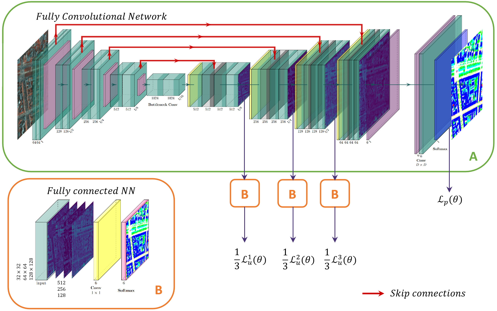

# CRFNet-RS
A Deep Convolutional Network to Learn the Potentials of a CRF for the Semantic Segmentation of Remote Sensing Images



This repository contains the code related to the paper:  

M. Pastorino, G. Moser, S. B. Serpico, and J. Zerubia, CRFNet: A Deep Convolutional Network to Learn the Potentials of a CRF for the Semantic Segmentation of Remote Sensing Images," in IEEE Transactions on Geoscience and Remote Sensing, doi: 10.1109/TGRS.2024.3452631. [https://inria.hal.science/hal-04683326](https://inria.hal.science/hal-04683326), [https://ieeexplore.ieee.org/document/10659885](https://ieeexplore.ieee.org/document/10659885).


When using this work, please cite our IEEE TGRS paper:

M. Pastorino, G. Moser, S. B. Serpico, and J. Zerubia, CRFNet: A Deep Convolutional Network to Learn the Potentials of a CRF for the Semantic Segmentation of Remote Sensing Images," in IEEE Transactions on Geoscience and Remote Sensing, doi: 10.1109/TGRS.2024.3452631. 

```
@ARTICLE{10659885,
  author={Pastorino, Martina and Moser, Gabriele and Serpico, Sebastiano B. and Zerubia, Josiane},
  journal={IEEE Transactions on Geoscience and Remote Sensing}, 
  title={CRFNet: A Deep Convolutional Network to Learn the Potentials of a CRF for the Semantic Segmentation of Remote Sensing Images}, 
  year={2024},
  volume={},
  number={},
  pages={1-19},
  doi={10.1109/TGRS.2024.3452631}}

```


## :gear: Installation

The code was built on a virtual environment running on Python 3.9

### Step :one:: Clone the repository

```
git clone --recursive https://github.com/Ayana-Inria/CRFNet-RS.git
```

### Step :two:: Install the dependencies

```
cd CRFNet-RS

pip install -r requirements.txt
```

### Step :three:: Run the code

1. Train the model on a scarce GT set 

```
python main.py -r -g conncomp
```
2. Infer on data

```
python main.py -g full
```


## :hammer: Project structure

```
semantic_segmentation
├── dataset - contains the data loader
├── input - images to train and test the network 
├── net - contains the loss, the network, and the training and testing functions
├── output - should contain the results of the training / inference
|   ├── exp_name
|   └── model.pth
├── utils - misc functions
└── main.py - program to run
```
  
## :toolbox: Data

The model is trained on the [ISPRS Vaihingen dataset](http://www2.isprs.org/commissions/comm3/wg4/2d-sem-label-vaihingen.html) and [ISPRS Potsdam dataset](http://www2.isprs.org/potsdam-2d-semantic-labeling.html). The two datasets consist of VHR optical images (spatial resolutions of 9 and 5cm, respectively), we used the IRRG channels. They can be downloaded on [Kaggle](https://www.kaggle.com/datasets/bkfateam/potsdamvaihingen) and should be inserted in the folder `/input`.

The data should have the following structure. 

```
input
├── top
|   └── top_mosaic_09cm_area{}.tif
├── gt
|   └── top_mosaic_09cm_area{}.tif
└── gt_eroded
    └── top_mosaic_09cm_area{}_noBoundary.tif
```

### :pencil2: :straight_ruler: Reproduce the training data

To obtain the scarce ground truth, use the function `conn_comp(gt, kernel)` provided in `utils/utils_dataset.py` to be applied on the original fully labeled ground truth until the remaining label information is 30\% or 10\%.

Training tiles:
```
Vaihingen: '1', '3', '23', '26', '7', '11', '13', '28', '17', '32', '34', '37'
Potsdam: '3_11', '4_11', '5_10', '6_7', '6_8', '6_9', '7_7', '7_8', '7_9', '7_10'
```

Test tiles:
```
Vaihingen: '5', '15', '21', '30'
Potsdam: '3_12', '4_10', '4_12', '5_11', '6_12'
```

### :receipt: Reproduce the evaluation results

You can download the weights of CRFNet for each dataset `(Vaihingen and Potsdam)`, ground truth condition `(full GT, 30% GT, 10% GT)`, and two different neighborhoods `(first order or second order)`, that produced the results published in the paper, from [Google Drive link](https://drive.google.com/drive/folders/1lUQ64GvajoYiQ8mrNQ2MUOpYD8sTdHhq?usp=sharing)

The model was trained with the following hyperparameters:

```
WINDOW_SIZE = (256, 256) # Patch size
STRIDE = 32 # Stride for testing
BATCH_SIZE = 10 # Number of samples in a mini-batch
base_lr = 0.01
weight_decay=0.0005
epochs = 30
```


## :new_moon_with_face: License

The code is released under the GPL-3.0-only license. See `LICENSE.md` for more details.

## :eyes: Acknowledgements

This work was conducted during my joint PhD at [INRIA](https://team.inria.fr/ayana/team-members/), d'Université Côte d'Azur and at the [University of Genoa](http://phd-stiet.diten.unige.it/). 
The ISPRS 2D Semantic Labeling Challenge Datasets were provided by the German Society for Photogrammetry, Remote Sensing and Geoinformation (DGPF).
The code to deal with the ISPRS dataset derives from the GitHub repository [Deep learning for Earth Observation](https://github.com/nshaud/DeepNetsForEO).
